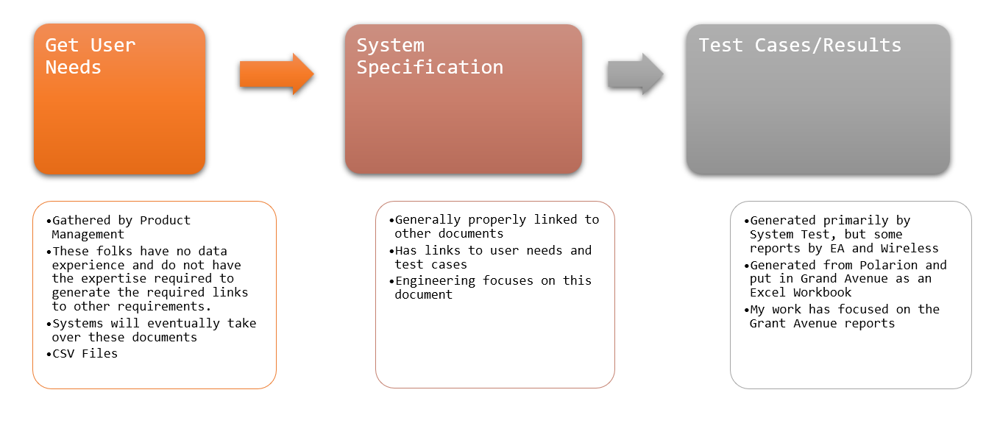
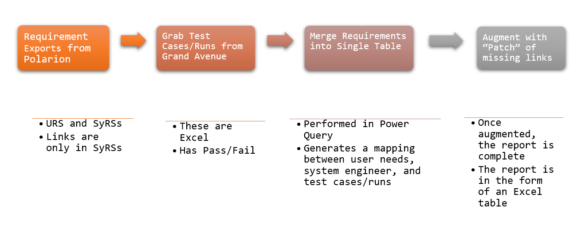

  

 
<h3 align=center>I am trying to generate a traceability matrix for a engineering program</h2>
 

<h1>User Needs → System Requirements → Test Cases</h1>

## Abstract

I needed to generate a report that shows the mapping between three types of documents:

- User Requirements Specifications: a collection of user needs
- System Requirement Specifications: all system requirements associated with meeting the user needs
- Test Cases/Runs: results of verifying the system requirements

Because all the input data is in the form of Excel workbooks and everyone at work has Excel, I decided to perform this analysis in Excel. The basic workflow is as follows:

  

## Background

## Analysis
