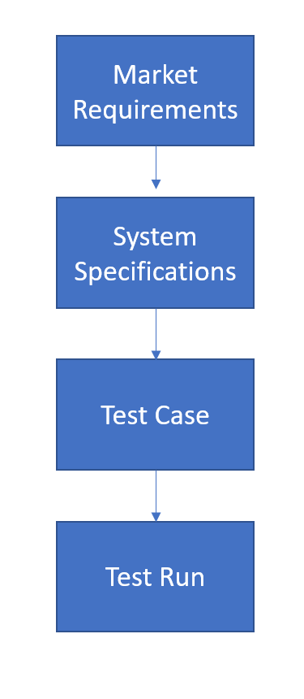

 
<h3 align=center>Much of my work consists of managing massive amounts of requirements.</h2>
<h4 align=center>Photo by C M on Unsplash.</h3>
 

# End-to-End Trace Matrix

## Abstract 

This analyis looks at tracing requirements from the marketing requirements through to the test results. I am going to begin this analysis using power query because I like how it allows you to explore the data quickly.

I expect the following from my exploratory data analysis:

* Determine whether every market requirement is covered by a test case
* Decide on the format of the report. This is a bit complicated because there the system specifications and test reports are broken down by program name.
* Determine if there are test reports with no corresponding user requriements. This should not be an issue with respect to traceablity, but it will help understanding what is going on. 

## Background

### Definitions

<dl>
<dt>Market Requirement</dt>
<dd>A requirement that describes a market need.</dd>
<dt>System Requirement</dt>
<dd>A requirement that describes a system behavior in service of a market requirement.</dd>
<dt>Test Case</dt>
<dd>A test designed to verify a system requirement.</dd>
<dt>Test Run</dt>
<dd>A scheduled execution of a test case.</dd>
</dl>

### Document Structure

My requirements flowdown in the following manner.

