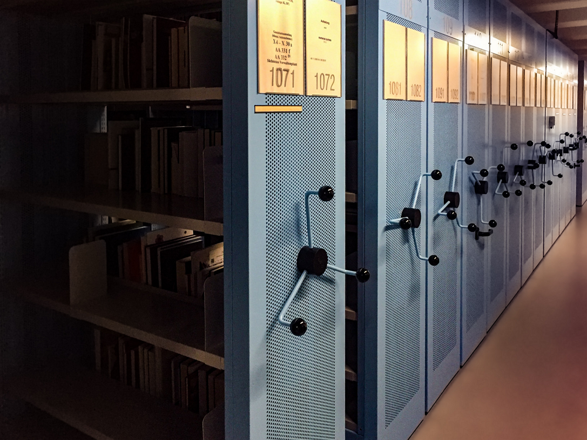
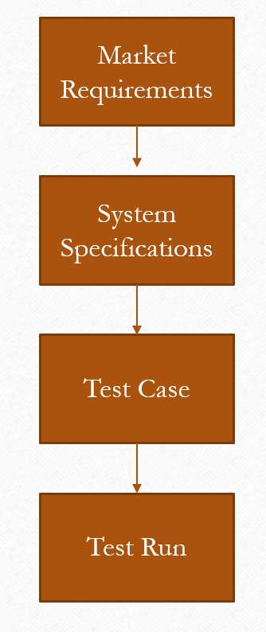

 
<h3 align=center>Much of my work consists of managing massive numbers of requirements.</h2>
<h4 align=center>Photo by C M on Unsplash.</h3>
 

# End-to-End Trace Matrix

## Abstract 

This analyis looks at tracing requirements from the marketing requirements through to the test results. I am going to begin this analysis using power query because I like how it allows you to explore the data quickly.

I expect the following from my exploratory data analysis:

* Determine whether every market requirement is covered by a test case
* Decide on the format of the report. This is a bit complicated because there the system specifications and test reports are broken down by program name.
* Determine if there are test reports with no corresponding user requriements. This should not be an issue with respect to traceablity, but it will help understanding what is going on. 

## Background

### Definitions

<dl>
<dt>Market Requirement</dt>
<dd>A requirement that describes a market need.</dd>
<dt>System Requirement</dt>
<dd>A requirement that describes a system behavior in service of a market requirement.</dd>
<dt>Test Case</dt>
<dd>A test designed to verify a system requirement.</dd>
<dt>Test Run</dt>
<dd>A scheduled execution of a test case.</dd>
</dl>

### Document Structure

The basic concept of the flowdown of requirements is pretty conventional, which is illustrated in the following figure.

Unfortunately, the implementation is very strange. The basic structure is shown in the following diagram. Here are the key features.

* Each product has one market specification
* The product has numerous variants.
	* Each variant requirement set is ~95% identical with the other variants.
    * The variants are built by different teams that each want their own specification.
* Each requirement must be verified using at least one test case.
* Each test case may require multiple runs to obtain a passed test.

